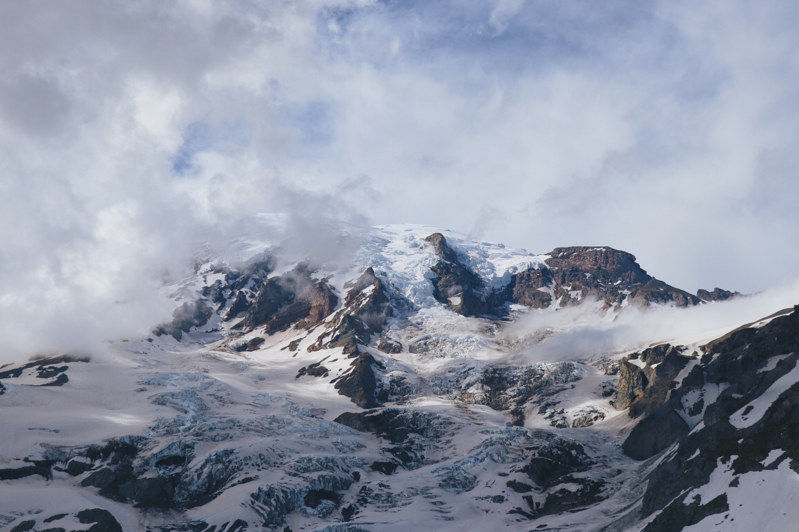

Ascending to 14,410 feet above sea level, Mount Rainier stands as an icon in the Washington landscape. An active volcano, Mount Rainier is the most glaciated peak in the contiguous U.S.A., spawning five major rivers. Subalpine wildflower meadows ring the icy volcano while ancient forest cloaks Mount Rainier’s lower slopes. Wildlife abounds in the park’s ecosystems. A lifetime of discovery awaits.

Also, how I struggle with React.
