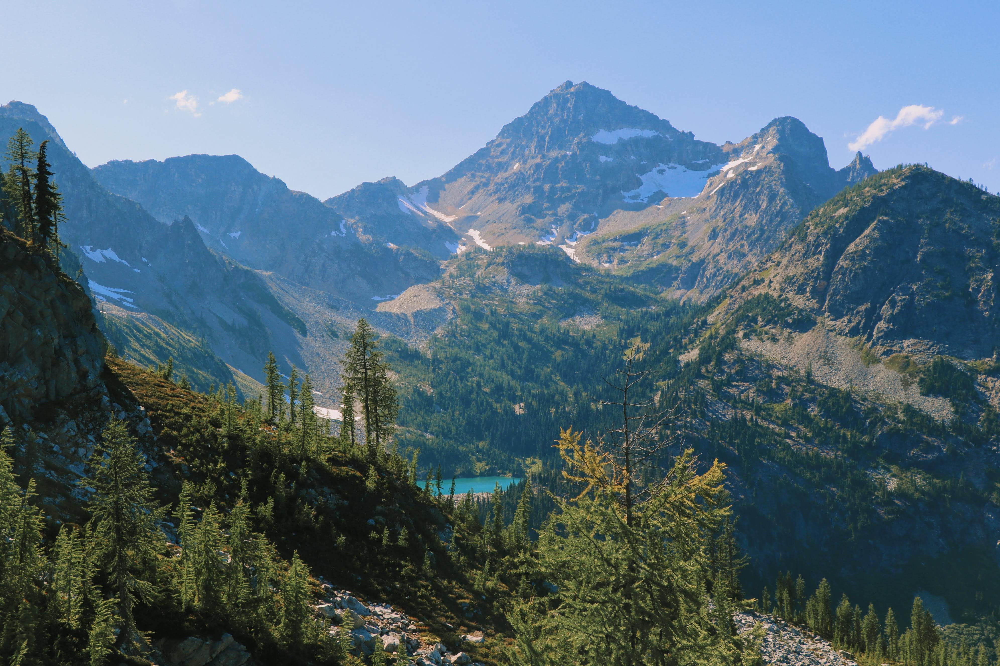

The Amazing North Cascades

Less than three hours from Seattle, an alpine landscape beckons. Discover communities of life adapted to moisture in the west and recurring fire in the east. Explore jagged peaks crowned by more than 300 glaciers. Listen to cascading waters in forested valleys. Witness a landscape sensitive to the Earth's changing climate. Help steward the ecological heart of the Cascades.
