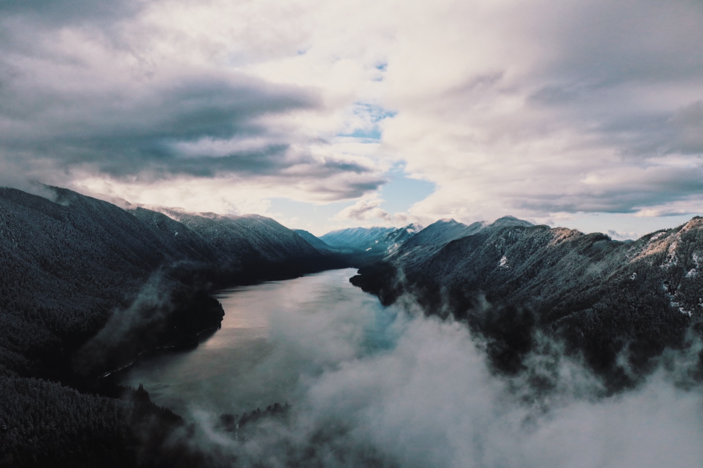

With its incredible range of precipitation and elevation, diversity is the hallmark of Olympic National Park. Encompassing nearly a million acres, the park protects a vast wilderness, thousands of years of human history, and several distinctly different ecosystems, including glacier-capped mountains, old-growth temperate rain forests, and over 70 miles of wild coastline. Come explore!
